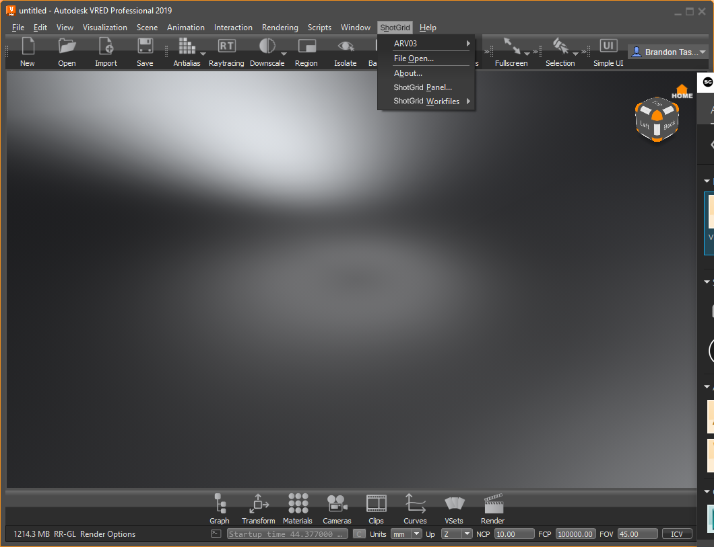

Overview
########

The ShotGrid engine for VRED contains a standard platform for integrating ShotGrid Apps into VRED. It is lightweight and straight forward and adds a ShotGrid menu to the VRED menu.

Supported Application Versions
==============================

This item has been tested and is known to be working on the following application versions:

2020.3 — 2023

Please note that it is perfectly possible, even likely, that it will work with more recent releases, however it has not yet been formally tested with these versions.

VRED Project Management
=======================

Whenever the ShotGrid engine for VRED starts, it will set the VRED Project to point at a location defined in the settings for this engine. This means that the Project may also change when a new file is opened. The details relating to how the VRED project is set based on a file can be configured in the configuration file, using the template system.

Engine Settings
===============

Like all the other engines, VRED comes with several settings allowing some worflow customizations.

Here is an example of the engine configuration::

    settings.tk-vred.asset_step:
      apps:
        tk-multi-about:
          location: "@apps.tk-multi-about.location"
        tk-multi-pythonconsole:
          location: "@apps.tk-multi-pythonconsole.location"
        tk-multi-breakdown2: "@settings.tk-multi-breakdown2.vred"
        tk-multi-loader2: "@settings.tk-multi-loader2.vred"
        tk-multi-publish2: "@settings.tk-multi-publish2.vred.asset_step"
        tk-multi-shotgunpanel: "@settings.tk-multi-shotgunpanel.vred"
        tk-multi-workfiles2: "@settings.tk-multi-workfiles2.vred.asset_step"
      menu_favourites:
      - {app_instance: tk-multi-workfiles2, name: File Open...}
      - {app_instance: tk-multi-workfiles2, name: File Save...}
      - {app_instance: tk-multi-publish2, name: Publish...}
      render_template: vred_asset_render_work
      run_at_startup:
      - {app_instance: tk-multi-shotgunpanel, name: ''}
      - {app_instance: tk-multi-pythonconsole, name: 'ShotGrid Python Console...'}
      docked_apps:
        tk-multi-shotgunpanel:
            pos: right
            tabbed: True
        tk-multi-pythonconsole:
            pos: right
            tabbed: True
      location: "@engines.tk-vred.location"

accepted_published_file_types
-----------------------------

A list of PublishedFileTypes that are allowed for review with VRED.

``default_value:`` [ VRED Scene, Alias File, Catpart File, Jt File, Igs File ]

compatibility_dialog_old_version
--------------------------------

Disable warning about older versions of VRED.

``default_value:`` True

compatibility_dialog_min_version
--------------------------------

Specify the minimum Application major version that will prompt a warning if it isn't yet fully supported and
tested with Toolkit. To disable the warning dialog for the version you are testing, it is recommended that you set this
value to the current major version + 1.

``default_value:`` 2023

docked_apps
-----------

Specify (docking related) properties for docked Apps. This is a dictionary where each key is the name of the
Toolkit App (e.g. tk-multi-shotunpanel) and values are a dictionary with two keys: 'pos' and 'tabbed'.
The 'pos' value is a str, and must be one of: 'left', 'right', 'top', 'bottom', which indicates the dock area
for the App. The 'tabbed' value is a bool, which indicates whether the docked App should be tabified with other
docked widgets or not.

``default_value:`` {}

render_template
---------------

Template used to determine where to set the VRED render images.
Should correspond to a template defined in templates.yml but can also be empty if you do not wish the VRED render path to be automatically set.

``default_value:`` None

run_at_startup
--------------

Controls what apps will run on startup.
This is a list where each element is a dictionary with two keys: 'app_instance' and 'name'. The app_instance
value connects this entry to a particular app instance defined in the environment configuration file.
The name is the menu name of the command to run when the VRED engine starts up. If name is '' then all commands
from the given app instance are started.

``default_value:`` []

Collaboration and Evolution
===========================

If you have access to the ShotGrid Pipeline Toolkit, you also have access to the source code for all apps, engines and frameworks in Github where we store and manage them. Feel free to evolve these items; use them as a base for further independent development, make changes (and submit pull requests back to us!) or simply tinker with them to see how they have been built and how the toolkit works. You can access this code repository at https://github.com/shotgunsoftware/tk-vred.