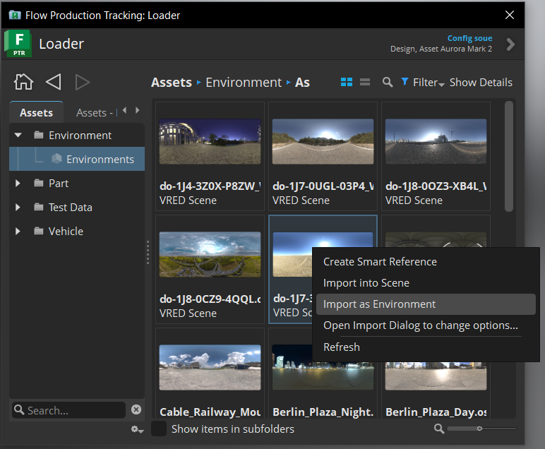
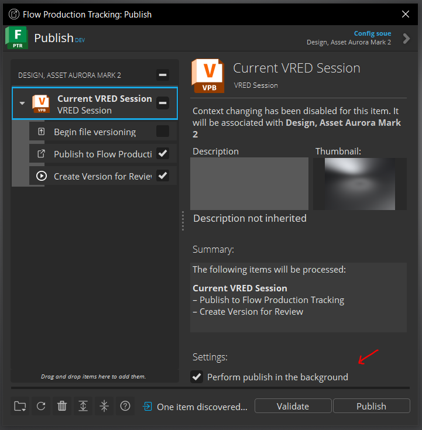

v3.5.0
=====================

Release highlights
------------------

* New action 'Import Envrionments' added to Loader2 actions
* Publish setting option added to turn on/off publishing in the background
* Bug fix FPTR Panel 'Create Smart Reference' action
* Bug fix 'Create Smart Reference' action only available for VRED native files

Dependencies
---------------

* Publish2 App: ``tk-multi-publish2 v2.10.3``

    * Includes update for the new publish setting option to turn on/off publishing in the background

* Configuration: ``tk-config-default v1.7.4`` or ``tk-config-basic v1.7.4``

    * Required for the new action 'Import Envrionments' added to Loader2 actions
    * Required to correctly show `Create Smart Reference` action for VRED native files

New Features
-------------

**Import Envrionemnts**

The Loader2 App now includes a new actiono **Import Environments** to import environments from a file. This requires configuration update to ``v1.7.4`` or later.

Flow Proudction Tracking file types supported:

* VRED Scene (.vpb)
* Osb File (.osb)

To import environments, right-click on a supported file type item in Loader2 App, and select **Import Environments**.

\

.. note::

    Import enviornments for Osb files requires VRED 2025.1 or later.

**Background Publishing Setting**

A new publish setting option has been added to the Publish2 App to turn on/off publishing in the background. This requires tk-multi-publish2 ``v2.10.3`` or later.

To use the new publish setting:

1. Open the Publish2 App
2. Click on the root publish item *Current VRED Session*
3. Check the Settings option *Perform publish in the background* to run the publish in the background (or uncheck to run normally)

\

.. note::

    This new setting in the Publish App has replaced the ``Background Processing`` configuration setting. This setting does not need to be added to perform background publishing, the setting in the Publish2 App will handle this. You may still set the configuration setting to set the default value of the checkbox option in the Publish App.

    .. image:: images/publish-bg-publish-config-setting.png
        :alt: Background Publish Setting
        :width: 800px
        :align: center

    \

Bug Fixes
-------------

* Before configuration ``v1.7.4``, the 'Create Smart Reference' action was shown for all file types. This was incorrect, since VRED only supports creating smart references for VRED native files. The action is now only shown for VRED native files.

* Before tk-vred ``3.5.0`` the FPTR Panel `Create Smart Reference` action was not working correctly.
